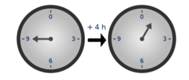

# Encode’s ZK bootcamp

Thème: Code - Informatique, Web3
Tags: Formation Complète
Formateur: Encode
Status: En cours
Date de création: July 24, 2023 2:43 PM

**Usefull links**

- **[website](https://www.encode.club/zk-bootcamp)**
- [ZK Bootcamp July 2023](https://www.notion.so/ZK-Bootcamp-July-2023-157fcb1fa18d44eaa5d7c29df74ea074?pvs=21)

Ressource :

- blog : [coders-errand.com](https://coders-errand.com/)
- podcast : [zeroknowledge.fm](https://zeroknowledge.fm/)

****Curriculum****

- Maths and cryptography introduction
- General theory of zero-knowledge proofs
- zk-SNARK / zk-STARK theory
- Development languages and platforms — Zokrates / Cairo / SnarkyJS
- Use of ZK proofs with blockchains — ZK rollups / Mina / snapps
- ZK proofs as proof of computation
- Data privacy
- ZK proofs in cryptocurrencies — Zcash / Monero
- ZK proofs and DeFi — Aztec and StarkEx

## Math Intro

[Introductory_Reading.pdf](https://file.notion.so/f/s/faba0237-8185-492f-944d-d6c46e05db86/Lesson1.pdf?id=d5685c29-eb08-460c-b5f9-494fecfdc371&table=block&spaceId=d0c8094a-e610-4814-9977-ce61e347ef5a&expirationTimestamp=1690466400000&signature=R1apscro5QhcFMBP89CgqM5M6UpP1lNV9LolFdsFxfc&downloadName=Lesson1.pdf)

**numbers**

- Set of Integers is **Z** : {…, -1,0,1,2…}
- Set of rational numbers is **Q** : {…1/2, 1, 3/2…}
- Set of Real Numbers is **R** : { 2, - 4, 4219, Pi, Racine(2)… }

**Also :**

- Fields are denoted by **F**
- we use **Zp*** for a finite field of int mod prime p (with multiplicative. inverses). (ps in french : we use Z/nZ instead of Zp)
- we use **finite fields** for cryptography

**Group theory**

## Day 1

---

### Homework 1

S = {0,1,2,3,4,5,6}

- 4+4 = 8
- 3 x 5 = 15
- inverse of 3 : ~~-3~~ → 1/3
- Can we consider ‘S’ and operation ‘+’ to be a group ?
- what’s -13 mod 5 ? 2 or -3 (2≡−3(mod5) ) but the remainder should be positive.
- for :

$$
x^3-x^2+4x-12
$$

- positive root ? : 2
- the degree of this polynomial ? : 3
